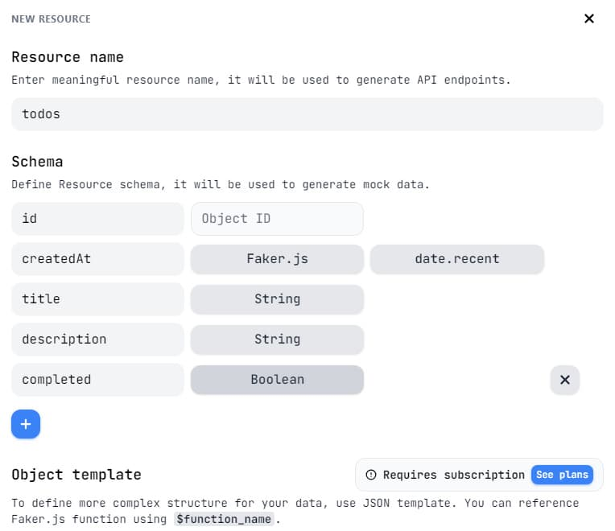
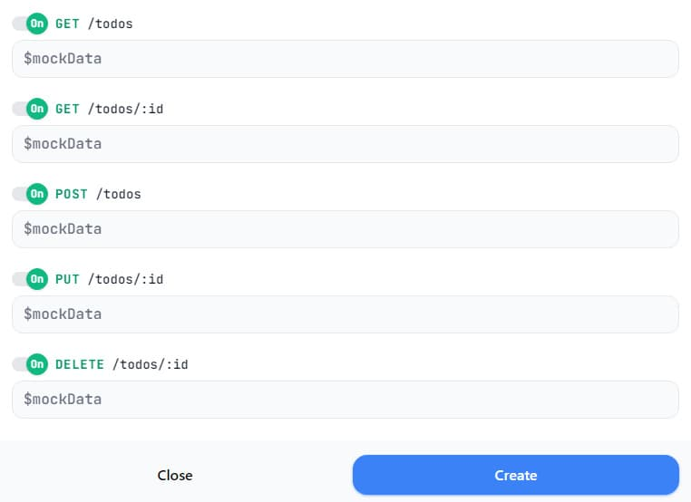

**Читать на других языках: [Русский](README.md),
[Українська](./docs/README.ua.md), [English](./docs/README.en.md).**

# Redux. Redux Toolkit. RTK Query.

## Приложение - «Список дел».

Приложение для создания, изменения и удаления списка дел (задач).

### 1. Бэкенд `mockapi.io`

Для бэкенда используется [mockapi.io](https://mockapi.io/). Необходимо:

- зарегистрироваться используя свой аккаунт _GitHub_.
- создать ресурс **_todos_** чтобы получить ендпоинт `/todos`.
- использовать конструктор ресурса и описать объект **todo** как на иллюстрации
ниже.
<details>
<summary>Посмотреть пример &nbsp;&#10552;</summary>



</details>

### 2. Настройка RTK Query

Ссылка на документацию по работе с
[Redux Toolkit](https://redux-toolkit.js.org/tutorials/quick-start#usage-summary)
и [RTK Query](https://redux-toolkit.js.org/rtk-query/overview#whats-included).

- Определить основные ендпоинты и схемы данных для ваших запросов. После
создания ресурса **_todos_**, основные ендпоинты для _CRUD_ операций будут как
на иллюстрации ниже.
<details>
<summary>Посмотреть пример &nbsp;&#10552;</summary>



</details><br>

- Создать slice в Redux Toolkit для управления данными, полученными из API с
  помощью `createApi`.

```react
import { createApi } from '@reduxjs/toolkit/query/react';
```

- Создать store, добавить в него slice и middleware.

```react
import { configureStore } from '@reduxjs/toolkit';

export const store = configureStore({
  reducer: {
	// Add the generated reducer as a specific top-level slice
	},
  middleware: getDefaultMiddleware => [
    ...getDefaultMiddleware(),
    todoApi.middleware,
  ],
})
```

- Обернуть приложение провайдером, добавив пропсом store.

```react
import { store } from './app/store';
import { Provider } from 'react-redux';

ReactDOM.render(
  <Provider store={store}>
    <App />
  </Provider>,
  document.getElementById('root')
)
```

### 3. Создание UI

Для создания пользовательского интерфейса используется фреймворк `Material UI`.
Нужно реализовать возможность добавления новых задач, удаления задач, изменения
задач и отметки задач как выполненных.
