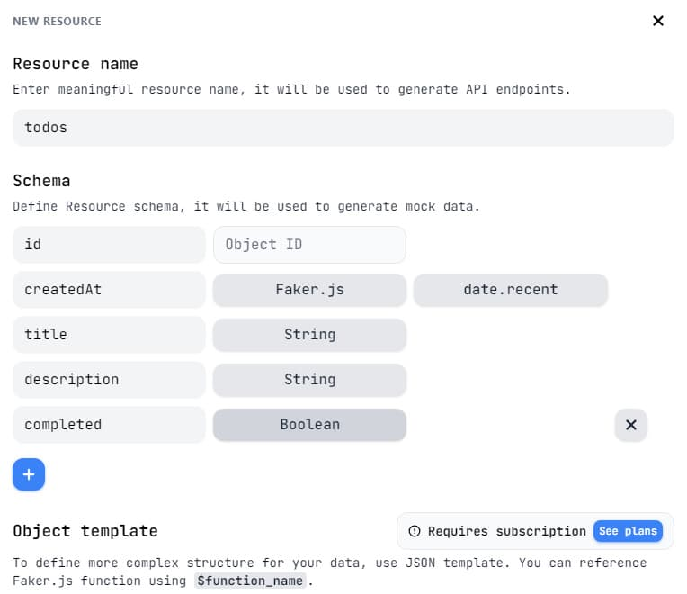

**Читать на других языках: [Русский](../README.md),
[Українська](./README.ua.md), [English](./README.en.md).**

# Redux. Redux Toolkit. RTK Query.

## "To-Do List" Application.

Application for creating, modifying and deleting to-do list (tasks).

### 1. Backend `mockapi.io`.

For the backend, [mockapi.io](https://mockapi.io/) is used. Required:

- register using your _GitHub_ account.
- create a **_todos_** resource to get the `/todos` endpoint.
- use the resource constructor and describe the **todo** object as in the
  illustration below.

<details>
<summary>See example &nbsp;&#10552;</summary>



</details>

### 2. Configuring RTK Query.

Link to the documentation on working with
[Redux Toolkit](https://redux-toolkit.js.org/tutorials/quick-start#usage-summary)
and [RTK Query](https://redux-toolkit.js.org/rtk-query/overview#whats-included).

- Identify the main endpoints and data schemas for your queries. After creating
  the **_todos_** resource, the main endpoints for _CRUD_ operations will be as
  in the illustration below.

<details>
<summary>See example &nbsp;&#10552;</summary>


</details><br>

- Create a slice in Redux Toolkit to manage data retrieved from the API using
  `createApi`.

```react
import { createApi } from '@reduxjs/toolkit/query/react';
```

- Create a store, add slice and middleware to it.

```react
import { configureStore } from '@reduxjs/toolkit';

export const store = configureStore({
  reducer: {
	// Add the generated reducer as a specific top-level slice
	},
  middleware: getDefaultMiddleware => [
    ...getDefaultMiddleware(),
    todoApi.middleware,
  ],
})
```

- Wrap the app with the `Provider` by adding store as a prop.

```react
import { store } from './app/store';
import { Provider } from 'react-redux';

ReactDOM.render(
  <Provider store={store}>
    <App />
  </Provider>,
  document.getElementById('root')
)
```

### 3. Creating a user interface.

The
[Material UI](https://mui.com/material-ui/getting-started/installation/#default-installation)
framework is used to create the user interface. Implement the ability to add new
tasks, delete tasks, modify tasks and mark tasks as completed.
